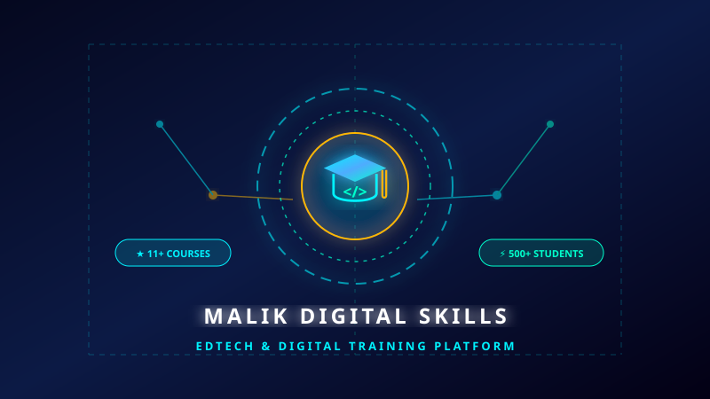

# 🌌 Hammadullah • Full Stack Developer & Web Architect

<div align="center">



[](https://github.com/Hammadullah506)
[](https://hammadullah506.github.io/malikdigitalskills/)
[](https://malikdigitalskill.lovable.app/)
[](https://wa.me/923475765612)
[](mailto:hammadullahnaseeb@gmail.com)

**Commanding Digital Realities • Full Stack Web Architect • 3D WebGL & Creative Technologist**

🌌 **Live Interactive 3D Galaxy View**: [https://hammadullah506.github.io/malikdigitalskills/](https://hammadullah506.github.io/malikdigitalskills/)  
🚀 **Featured Project Platform**: [https://malikdigitalskill.lovable.app/](https://malikdigitalskill.lovable.app/)  
📂 **Source Code Repository**: [https://github.com/Hammadullah506/malikdigitalskills](https://github.com/Hammadullah506/malikdigitalskills)

</div>

---

## 🚀 Overview

Welcome to the official developer portfolio of **Hammadullah** ([@Hammadullah506](https://github.com/Hammadullah506)). This project is a state-of-the-art, high-performance web experience blending **computational full-stack engineering** with **immersive Three.js 3D WebGL stardust simulations** and **binaural Web Audio synthesis**.

Designed with a sleek **Cosmic Glassmorphism HUD** aesthetic, this portfolio highlights enterprise-grade web development skills, interactive project telemetry, real-time Warp Core physics manipulation, and live production platforms.

---

## 🌟 Featured Project: Malik Digital Skills Platform

<div align="center">

| Project Details | Link |
| :--- | :--- |
| **Platform Name** | [Malik Digital Skills Training Institute](https://malikdigitalskill.lovable.app/) |
| **Live URL** | [https://malikdigitalskill.lovable.app/](https://malikdigitalskill.lovable.app/) |
| **Category** | EdTech & Full Stack Web Platform |
| **Status** | Production Ready • 500+ Students Enrolled |
| **Key Technologies** | React, Vite, Tailwind CSS, JavaScript (ES6+), WhatsApp Business API |

</div>

### Key Capabilities of Malik Digital Skills
- **11+ Skill-Based Courses**: Vibe Coding, AI & Prompt Engineering, Frontend Web Development, Graphic Design, Shopify E-Commerce, and Freelancing.
- **Automated Admission Pipeline**: Direct WhatsApp routing for seamless course enrollment and scholarship processing.
- **Ultra-Responsive UI**: Crafted for instantaneous load times and smooth mobile exploration.
- **Interactive Student Telemetry**: Verified student reviews, syllabus breakdowns, and pricing calculators.

---

## 🛠️ Tech Constellations & Arsenal

```
├── 🌐 Frontend Orbits
│   ├── React & Next.js 14 (App Router, Server Components)
│   ├── TypeScript & ES6+ (Strict Typing, Async Pipelines)
│   ├── Three.js & WebGL (Custom Shaders, 3D Particle Cloud)
│   └── Modern CSS / Tailwind CSS / Glassmorphism HUD
│
├── ⚙️ Backend Engines
│   ├── Node.js & Express (RESTful APIs, JWT Auth)
│   ├── Python (FastAPI, LLMs, AI Workflow Orchestration)
│   └── PostgreSQL, MongoDB, Prisma ORM, Redis Caching
│
└── ☁️ DevOps & Cloud Infrastructure
    ├── Docker Containerization & Microservices
    ├── Git & GitHub CI/CD Actions
    └── Vercel, AWS S3 & Cloud Deployments
```

---

## ✨ Interactive Features

- 🪐 **Interactive Three.js 3D Galaxy Canvas**: Real-time celestial star particle physics with dynamic camera warp acceleration.
- 🎛️ **Warp Core Controller**: Interactive lab slider to manipulate galaxy spin velocities and live nebula color themes (*Supernova Cyan, Cosmic Magenta, Solar Flare, Void Emerald*).
- 🔊 **Web Audio Synthesizer**: Procedural ambient cosmic drone soundscape with custom filter modulation and UI hover SFX.
- 📊 **Telemetry Specs Modals**: Deep-dive modals displaying architectural highlights, system stats, and source code links for every project.
- 📡 **Deep Space Uplink**: Holographic contact transmission terminal with simulated AES-256 signal broadcasting.

---

## 📦 Project Structure

```bash
malikdigitalskills/
├── assets/
│   ├── malikdigital.svg   # Malik Digital Skills high-tech banner
│   ├── nova.svg           # NovaAI project banner
│   ├── aetheria.svg       # Aetheria 3D project banner
│   ├── quantum.svg        # QuantumCommerce project banner
│   ├── chronos.svg        # Chronos Nexus project banner
│   ├── cyberpulse.svg     # CyberPulse project banner
│   └── starlight.svg      # Starlight Studio banner
├── css/
│   └── style.css          # Cosmic neon glassmorphism stylesheet & tokens
├── js/
│   ├── app.js             # UI interactions, modals, typing effect, contact
│   ├── audio.js           # Web Audio API ambient cosmic soundscape synthesizer
│   └── galaxy.js          # Three.js 3D galaxy particle simulation & warp engine
├── index.html             # Main entry point & semantic HTML5 structure
├── .gitignore             # Git ignore configuration
└── README.md              # Documentation & repository showcase
```

---

## 💻 Local Development Setup

To run this project locally on your machine:

1. **Clone the repository**:
   ```bash
   git clone https://github.com/Hammadullah506/malikdigitalskills.git
   cd malikdigitalskills
   ```

2. **Launch with any local web server**:
   - Using VS Code **Live Server** extension (Right-click `index.html` -> *Open with Live Server*).
   - Or using Python:
     ```bash
     python -m http.server 3000
     ```
   - Or using Node `npx serve`:
     ```bash
     npx serve .
     ```

3. **Open in Browser**:
   Navigate to `http://localhost:3000` or the port shown in your terminal.

---

## 📡 Transmission & Contact Channels

- **Developer**: Hammadullah
- **GitHub**: [@Hammadullah506](https://github.com/Hammadullah506)
- **WhatsApp**: [+92 347 5765612](https://wa.me/923475765612)
- **Email**: [hammadullahnaseeb@gmail.com](mailto:hammadullahnaseeb@gmail.com)
- **Featured Live App**: [https://malikdigitalskill.lovable.app/](https://malikdigitalskill.lovable.app/)

---

<div align="center">
  <sub>Architected with ❤️, Three.js WebGL & Cosmic Resonance by <strong>Hammadullah</strong>.</sub>
</div>